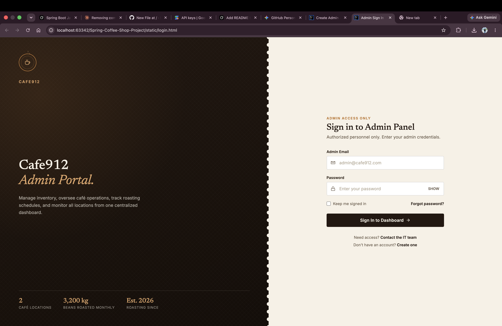
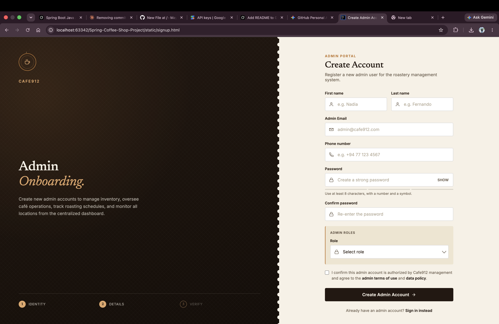
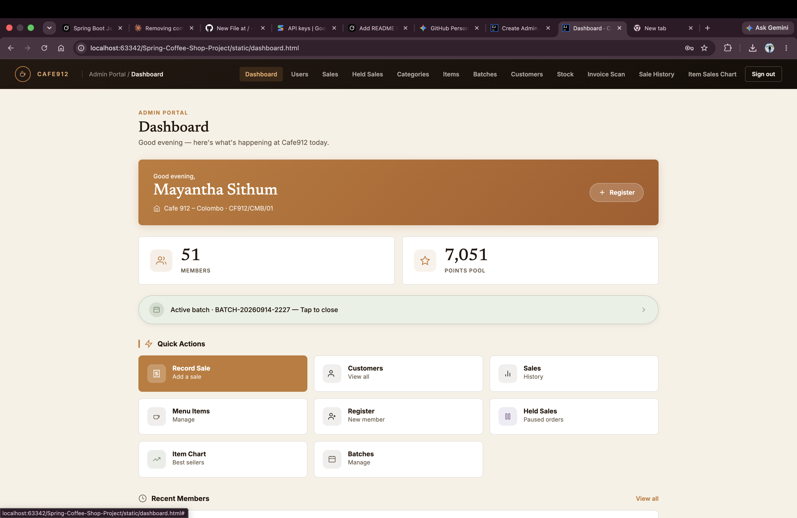
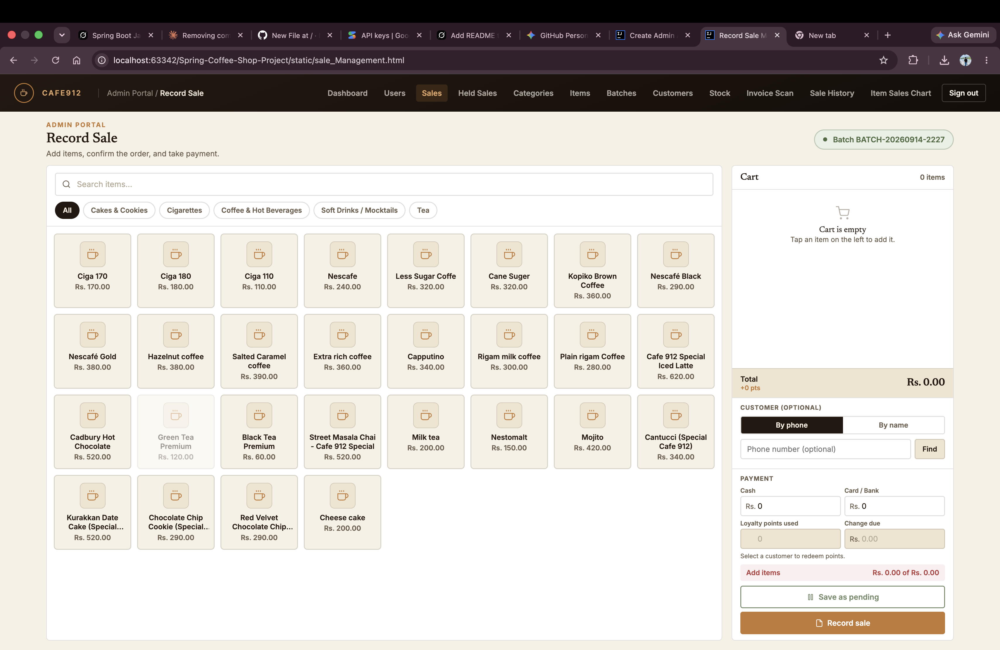
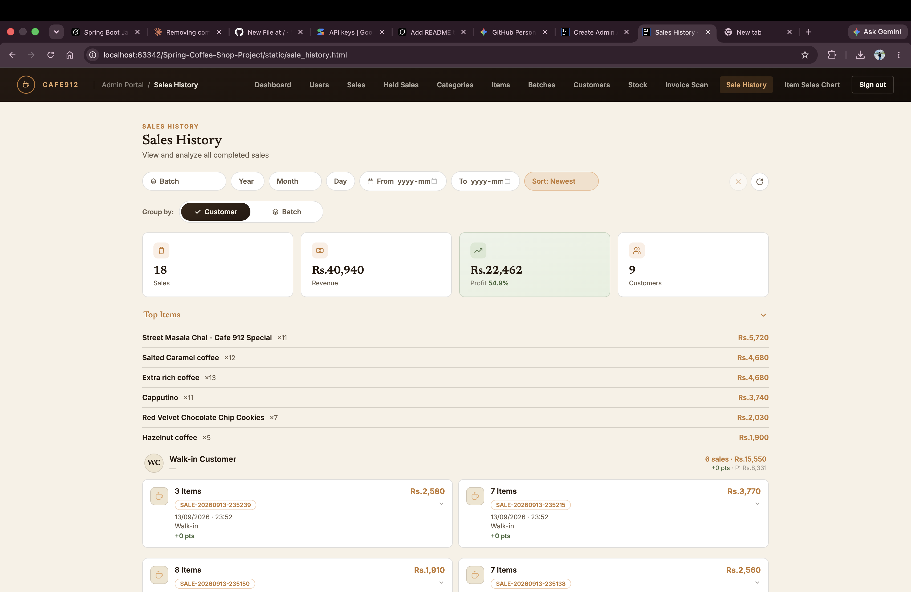

# ☕ Cafe912 — Coffee Shop Management System

A full-featured **roastery & café management system** built with **Spring Boot 3**.  
Manage inventory, POS sales, customers, loyalty points, supplier invoices (AI-powered), users, and more — from a polished admin portal.

**Brand:** Cafe912 · Est. 2026

---

## ✨ Features

| Module | Description |
|--------|-------------|
| **Dashboard** | Live overview — members, loyalty points pool, active batch, quick actions |
| **User Management** | Register, login, email verification, role-based access (Admin / Super Admin / Manager) |
| **Category & Item Management** | Menu categories and items with pricing |
| **Batch Management** | Open/close daily batches for sales tracking |
| **Stock Management** | Real-time stock levels and stock transactions |
| **Sales (POS)** | Record sales with cart, cash/card payments, loyalty points redemption |
| **Held Sales** | Pause and resume incomplete orders |
| **Customer Management** | Customer profiles with **loyalty points** system |
| **Invoice Scan (AI)** | Upload supplier invoices → **Gemini AI** extracts items → confirm to update stock |
| **Sales History** | Filter by batch/date, revenue, profit, top items, customer grouping |
| **Item Sales Chart** | Visual insights into best sellers |

---

## 🖼️ Screenshots

### Login & Signup
| Login | Create Account |
|-------|----------------|
|  |  |

### Dashboard


### Record Sale (POS)


### Sales History


> **How to add screenshots:** Save the images into `docs/screenshots/` with the names above (`login.png`, `signup.png`, `dashboard.png`, `sale.png`, `sale-history.png`).

---

## 🛠️ Tech Stack

| Layer | Technology |
|-------|------------|
| Backend | Spring Boot 3.2.3, Java 17 |
| Security | Spring Security + JWT (JJWT 0.12.3) |
| Persistence | Spring Data JPA + Hibernate |
| Database | MySQL |
| Email | Spring Mail (Gmail SMTP) |
| AI | Google Gemini (invoice OCR / extraction) |
| Frontend | Static HTML + JavaScript (served by Spring) |
| Build | Maven |
| Utilities | Lombok |

---

## 📁 Project Structure

```
Spring-Coffee-Shop-Project/
├── src/main/java/com/example/Spring_Coffee_Shop_Project/
│   ├── controller/          # REST API endpoints
│   ├── service/ & impl/     # Business logic
│   ├── repository/          # JPA repositories
│   ├── entity/              # Database entities
│   ├── dto/                 # Data Transfer Objects
│   ├── security/            # JWT filter & SecurityConfig
│   ├── config/              # Web / CORS config
│   └── enumeration/         # Roles, statuses, etc.
├── src/main/resources/
│   ├── static/              # Frontend HTML pages
│   └── application.properties
├── docs/screenshots/        # README screenshots (optional)
└── pom.xml
```

---

## 🚀 Getting Started

### Prerequisites

- **Java 17+**
- **Maven 3.8+**
- **MySQL 8+**
- Gmail account (for email verification) – optional for local testing
- Google Gemini API key (for invoice scanning) – optional

### 1. Clone the repository

```bash
git clone https://github.com/YOUR_USERNAME/Spring-Coffee-Shop-Project.git
cd Spring-Coffee-Shop-Project
```

### 2. Create the database

```sql
CREATE DATABASE spring_coffee_shop_project;
```

(Or let the app create it automatically via `createDatabaseIfNotExist=true`.)

### 3. Configure application properties

Edit `src/main/resources/application.properties`:

```properties
# Database
spring.datasource.url=jdbc:mysql://localhost:3306/spring_coffee_shop_project?createDatabaseIfNotExist=true
spring.datasource.username=root
spring.datasource.password=YOUR_MYSQL_PASSWORD

# JWT (change this in production!)
jwt.secret=YOUR_LONG_RANDOM_SECRET
jwt.expiration=86400000

# Email (Gmail)
spring.mail.username=YOUR_GMAIL
spring.mail.password=YOUR_APP_PASSWORD

# Gemini AI (invoice scan)
spring.ai.gemini.api-key=YOUR_GEMINI_API_KEY
gemini.model=gemini-1.5-flash
```

> **Tip:** Use environment variables for secrets:
> ```bash
> export MAIL_USERNAME=...
> export MAIL_PASSWORD=...
> export GEMINI_API_KEY=...
> ```

### 4. Run the application

```bash
./mvnw spring-boot:run
```

Or with Maven:

```bash
mvn spring-boot:run
```

The app starts at: **http://localhost:8080**

### 5. Open the UI

| Page | URL |
|------|-----|
| Login | http://localhost:8080/login.html |
| Signup | http://localhost:8080/signup.html |
| Dashboard | http://localhost:8080/dashboard.html |

---

## 🔐 Authentication

- **JWT-based** stateless authentication
- Password hashing with **BCrypt** (strength 12)
- Email verification on registration
- Protected API endpoints (most routes require a valid Bearer token)

Public endpoints include:
- `/v1/users/register/**`
- `/v1/users/login/**`
- `/v1/users/verify/**`
- Static login / signup / verify pages

---

## 🤖 AI Invoice Scanning

1. Go to **Invoice Scan** page
2. Upload a supplier invoice image (PNG/JPG)
3. Gemini extracts line items automatically
4. Review → **Confirm** to update stock, or **Reject**

---

## 👥 User Roles

| Role | Description |
|------|-------------|
| `SUPER_ADMIN` | Full system access |
| `ADMIN` | Administrative privileges |
| `MANAGER` | Day-to-day management |

---

## 📦 Main API Endpoints

| Resource | Base Path |
|----------|-----------|
| Users | `/v1/users` |
| Categories | `/v1/categories` |
| Items | `/v1/items` |
| Batches | `/v1/batches` |
| Stock | `/v1/stock` |
| Sales | `/v1/sales` |
| Held Sales | `/v1/held-sales` |
| Customers | `/v1/customers` |
| Invoices | `/v1/invoices` |

All secured endpoints require header:
```
Authorization: Bearer <your-jwt-token>
```

---

## ⚙️ Configuration Notes

- **File uploads** (invoices): max 10 MB
- **CORS**: enabled for all origins (adjust for production)
- **JPA**: `ddl-auto=update` (tables are auto-created/updated)

---

## 📝 License

This project is for educational / portfolio purposes.

---

## 👨‍💻 Author

Built with ☕ for **Cafe912**.

Feel free to fork, star, and contribute!

---

**Happy coding!** 🚀
